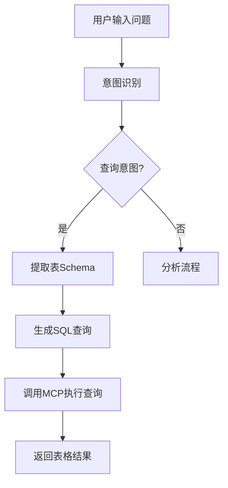
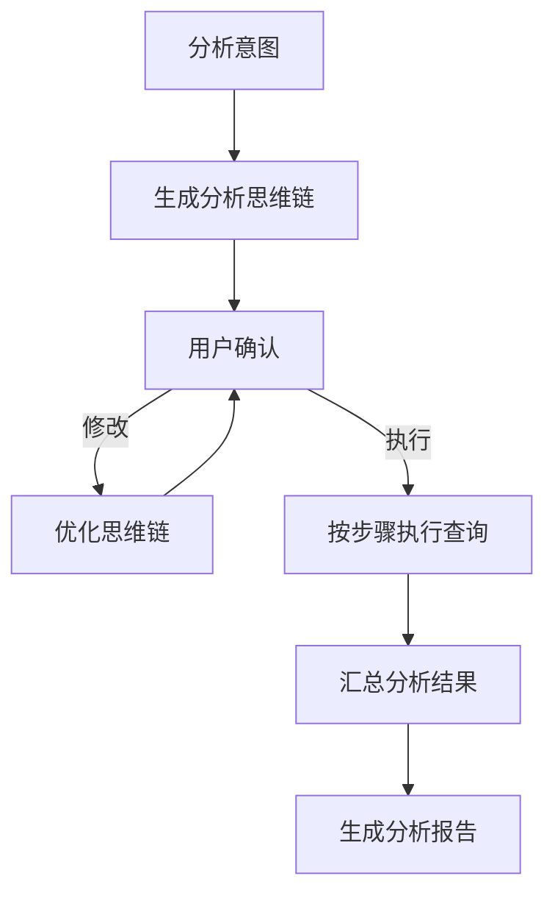

# 生成式BI数据库查询程序规划

## 项目概述

基于Streamlit前端和API后端的生成式BI系统，支持自然语言查询数据库并生成智能分析报告。

## 技术架构

### 前端技术栈
- **Streamlit**: 主要UI框架
- **Streamlit Components**: 自定义组件支持
- **Plotly**: 数据可视化
- **Pandas**: 数据处理

### 后端技术栈
- **FastAPI**: API服务框架
- **SQLAlchemy**: 数据库ORM
- **PyAthena**: AWS Athena连接器
- **PyMySQL**: MySQL连接器
- **Pydantic**: 数据验证
- **MCP (Model Context Protocol)**: 工具集成

### 存储方案
- **本地JSON文件**: 配置存储
- **数据库**: AWS Athena / MySQL

## 系统架构图

```
┌─────────────────┐    ┌─────────────────┐    ┌─────────────────┐
│   Streamlit     │    │   FastAPI       │    │   MCP Servers   │
│   Frontend      │◄──►│   Backend       │◄──►│   (stdio/sse)   │
└─────────────────┘    └─────────────────┘    └─────────────────┘
         │                       │                       │
         │                       │                       │
         ▼                       ▼                       ▼
┌─────────────────┐    ┌─────────────────┐    ┌─────────────────┐
│  Local JSON     │    │   LLM Service   │    │   Databases     │
│  Configuration  │    │   (OpenAI/etc)  │    │ (Athena/MySQL)  │
└─────────────────┘    └─────────────────┘    └─────────────────┘
```

## 页面设计

### 1. LLM配置页面 (`pages/llm_config.py`)

**功能需求:**
- 支持OpenAI Compatible API配置
- 多模型提供商支持(OpenAI, Azure OpenAI, 本地模型等)
- API连接测试功能
- 配置信息本地JSON存储

**界面元素:**
```
┌─ LLM提供商选择 ──┐
│ ○ OpenAI        │
│ ○ Azure OpenAI   │
│ ○ 自定义Endpoint │
└─────────────────┘

┌─ OpenAI配置 ─────┐
│ API Key: [密码框] │
│ Model: [下拉选择] │
│ Base URL: [输入框]│
│ Organization: [输入框]│
└─────────────────┘

┌─ Azure OpenAI配置 ─┐
│ API Key: [密码框]   │
│ Endpoint: [输入框]  │
│ API Version: [输入框]│
│ Deployment: [输入框]│
└───────────────────┘

┌─ 自定义配置 ─────┐
│ Base URL: [输入框]│
│ API Key: [密码框] │
│ Model: [输入框]   │
│ Headers: [JSON编辑器]│
└─────────────────┘

┌─ 模型参数 ───────┐
│ Temperature: [滑块]│
│ Max Tokens: [输入框]│
│ Top P: [滑块]     │
└─────────────────┘

[测试连接] [保存配置]
```

**配置文件结构:**
```json
{
  "llm_config": {
    "provider": "openai",
    "openai": {
      "api_key": "sk-xxx",
      "base_url": "https://api.openai.com/v1",
      "model": "gpt-4",
      "organization": ""
    },
    "azure_openai": {
      "api_key": "xxx",
      "endpoint": "https://xxx.openai.azure.com/",
      "api_version": "2024-02-01",
      "deployment_name": "gpt-4"
    },
    "custom": {
      "base_url": "http://localhost:11434/v1",
      "api_key": "ollama",
      "model": "llama2",
      "headers": {}
    },
    "parameters": {
      "temperature": 0.7,
      "max_tokens": 4000,
      "top_p": 0.9
    }
  }
}
```

### 2. 数据库配置页面 (`pages/database_config.py`)

**功能需求:**
- 支持AWS Athena和MySQL数据库配置
- 配置信息本地JSON存储
- 连接测试功能

**界面元素:**
```
┌─ 数据库类型选择 ─┐
│ ○ AWS Athena    │
│ ○ MySQL         │
└─────────────────┘

┌─ Athena配置 ─────┐
│ Region: [输入框]  │
│ S3 Output: [输入框]│
│ Access Key: [输入框]│
│ Secret Key: [密码框]│
└─────────────────┘

┌─ MySQL配置 ──────┐
│ Host: [输入框]    │
│ Port: [输入框]    │
│ Database: [输入框]│
│ Username: [输入框]│
│ Password: [密码框]│
└─────────────────┘

┌─ 查询设置 ───────┐
│ 最大返回行数: [输入框]│
│ (默认: 100)      │
└─────────────────┘

[测试连接] [保存配置]
```

**配置文件结构:**
```json
{
  "databases": {
    "athena": {
      "region": "us-east-1",
      "s3_output_location": "s3://bucket/path/",
      "aws_access_key_id": "xxx",
      "aws_secret_access_key": "xxx",
      "max_rows": 100
    },
    "mysql": {
      "host": "localhost",
      "port": 3306,
      "database": "test_db",
      "username": "user",
      "password": "pass",
      "max_rows": 100
    }
  }
}
```

### 3. 数据库表Schema配置页面 (`pages/schema_config.py`)

**功能需求:**
- 自动获取数据库表结构
- 手动编辑表描述和字段说明
- Schema信息本地存储

**界面元素:**
```
┌─ 数据库选择 ─────┐
│ [下拉选择框]     │
└─────────────────┘

┌─ 表列表 ─────────┐
│ □ table1         │
│ □ table2         │
│ □ table3         │
└─────────────────┘

┌─ 表详情 ─────────┐
│ 表名: customers   │
│ 描述: [文本框]    │
│                  │
│ 字段列表:        │
│ - id (int): 主键  │
│ - name (varchar): 姓名│
│ - email (varchar): 邮箱│
└─────────────────┘

[刷新Schema] [保存配置]
```

### 4. 聊天窗口页面 (`pages/chat.py`)

**功能需求:**
- 自然语言查询界面
- 意图识别(查询/分析)
- 查询结果展示
- 分析规划和执行

**界面布局:**
```
┌─ 聊天历史 ───────────────────────────────────┐
│ 用户: 查询所有客户的订单数量                    │
│ 系统: [意图: 查询]                           │
│       需要查询表: customers, orders          │
│       SQL: SELECT c.name, COUNT(o.id)...    │
│       [查询结果表格]                         │
│                                            │
│ 用户: 分析客户购买趋势                        │
│ 系统: [意图: 分析]                           │
│       [分析思维链]                           │
│       [执行] [修改]                          │
└────────────────────────────────────────────┘

┌─ 输入区域 ───────────────────────────────────┐
│ [文本输入框]                    [发送]        │
└────────────────────────────────────────────┘
```

### 5. MCP工具管理页面 (`pages/mcp_management.py`)

**功能需求:**
- 注册MCP Server
- 支持stdio和sse两种模式
- 工具状态监控

**界面元素:**
```
┌─ 添加MCP Server ─┐
│ 名称: [输入框]    │
│ 类型: ○stdio ○sse│
│ 配置: [JSON编辑器]│
│ [添加]           │
└─────────────────┘

┌─ MCP Server列表 ─┐
│ athena-tool ●    │
│ mysql-tool  ●    │
│ analysis-tool ○  │
│ [编辑] [删除] [启动/停止]│
└─────────────────┘
```

**MCP配置文件:**
```json
{
  "mcp_servers": {
    "athena-tool": {
      "type": "stdio",
      "command": "python",
      "args": ["mcp_athena_server.py"],
      "status": "active"
    },
    "mysql-tool": {
      "type": "sse",
      "url": "http://localhost:8001/mcp",
      "status": "active"
    }
  }
}
```

### 6. API接口页面 (`pages/api_docs.py`)

**功能需求:**
- API列表展示
- Swagger UI集成
- API状态监控

**界面元素:**
```
┌─ API服务状态 ────┐
│ Backend API: ●   │
│ MCP Gateway: ●   │
└─────────────────┘

┌─ API端点列表 ────┐
│ POST /chat/query │
│ POST /chat/analyze│
│ GET  /database/schema│
│ POST /mcp/execute│
└─────────────────┘

[Swagger UI文档] [API测试工具]
```

## 数据流程设计

### 查询流程


### 分析流程


## 项目结构

```
GenBI-Demo/
├── app.py                      # Streamlit主应用
├── config/
│   ├── llm_config.json         # LLM配置
│   ├── database_config.json    # 数据库配置
│   ├── schema_config.json      # 表结构配置
│   └── mcp_config.json         # MCP服务配置
├── pages/
│   ├── llm_config.py           # LLM配置页面
│   ├── database_config.py      # 数据库配置页面
│   ├── schema_config.py        # Schema配置页面
│   ├── chat.py                 # 聊天界面
│   ├── mcp_management.py       # MCP管理页面
│   └── api_docs.py             # API文档页面
├── backend/
│   ├── main.py                 # FastAPI主服务
│   ├── routers/
│   │   ├── chat.py             # 聊天API
│   │   ├── database.py         # 数据库API
│   │   └── mcp.py              # MCP API
│   ├── services/
│   │   ├── llm_service.py      # LLM服务
│   │   ├── intent_service.py   # 意图识别
│   │   ├── query_service.py    # 查询生成
│   │   └── analysis_service.py # 分析服务
│   └── models/
│       ├── database.py         # 数据库模型
│       ├── chat.py             # 聊天模型
│       └── mcp.py              # MCP模型
├── mcp_servers/
│   ├── athena_server.py        # Athena MCP服务器
│   ├── mysql_server.py         # MySQL MCP服务器
│   └── analysis_server.py      # 分析工具服务器
├── utils/
│   ├── config_manager.py       # 配置管理
│   ├── database_connector.py   # 数据库连接器
│   └── mcp_client.py           # MCP客户端
└── requirements.txt            # 依赖包列表
```

## API设计

### 聊天API (`/api/chat`)
```python
# 查询接口
POST /api/chat/query
{
  "question": "查询所有客户信息",
  "database": "mysql"
}

# 分析接口
POST /api/chat/analyze
{
  "question": "分析销售趋势",
  "database": "athena"
}

# 优化分析链
POST /api/chat/optimize-chain
{
  "original_chain": [...],
  "feedback": "需要按月份分组"
}
```

### 数据库API (`/api/database`)
```python
# 获取Schema
GET /api/database/schema?db=mysql

# 测试连接
POST /api/database/test-connection
{
  "type": "mysql",
  "config": {...}
}
```

### MCP API (`/api/mcp`)
```python
# 执行MCP工具
POST /api/mcp/execute
{
  "server": "athena-tool",
  "tool": "query",
  "params": {...}
}

# 获取MCP状态
GET /api/mcp/status
```

### LLM API (`/api/llm`)
```python
# 测试LLM连接
POST /api/llm/test-connection
{
  "provider": "openai",
  "config": {...}
}

# 获取可用模型列表
GET /api/llm/models?provider=openai

# 调用LLM
POST /api/llm/chat
{
  "messages": [...],
  "model": "gpt-4",
  "temperature": 0.7
}
```

## 核心算法

### 意图识别算法
```python
def identify_intent(question: str) -> str:
    """
    使用LLM识别用户意图
    返回: "query" 或 "analysis"
    """
    prompt = f"""
    分析以下问题的意图，返回"query"或"analysis":
    - query: 直接查询数据
    - analysis: 需要分析和洞察
    
    问题: {question}
    """
    # 调用LLM API
    return llm_response
```

### SQL生成算法
```python
def generate_sql(question: str, schema: dict) -> str:
    """
    基于问题和Schema生成SQL
    """
    prompt = f"""
    基于以下表结构生成SQL查询:
    Schema: {schema}
    问题: {question}
    
    要求:
    1. 只返回SQL语句
    2. 确保语法正确
    3. 优化查询性能
    """
    return llm_response
```

### 分析链生成算法
```python
def generate_analysis_chain(question: str) -> list:
    """
    生成分析思维链
    """
    prompt = f"""
    为以下分析问题生成步骤化的思维链:
    问题: {question}
    
    返回JSON格式:
    [
      {"step": 1, "action": "查询基础数据", "description": "..."},
      {"step": 2, "action": "数据清洗", "description": "..."},
      {"step": 3, "action": "趋势分析", "description": "..."}
    ]
    """
    return json.loads(llm_response)
```

## 部署方案

### 开发环境
```bash
# 启动后端服务
cd backend && uvicorn main:app --reload --port 8000

# 启动前端服务
streamlit run app.py --server.port 8501

# 启动MCP服务器
python mcp_servers/athena_server.py
python mcp_servers/mysql_server.py
```

### 生产环境
- 使用Docker容器化部署
- Nginx反向代理
- 配置HTTPS证书
- 数据库连接池优化

## 安全考虑

1. **数据库凭证加密存储**
2. **API访问权限控制**
3. **SQL注入防护**
4. **敏感数据脱敏**
5. **审计日志记录**

## 性能优化

1. **查询结果缓存**
2. **数据库连接池**
3. **异步处理**
4. **分页查询**
5. **索引优化建议**

## 测试策略

1. **单元测试**: 核心算法测试
2. **集成测试**: API接口测试
3. **端到端测试**: 完整流程测试
4. **性能测试**: 并发查询测试
5. **安全测试**: 权限和注入测试

## 扩展计划

1. **支持更多数据库类型** (PostgreSQL, BigQuery)
2. **可视化图表生成**
3. **报告导出功能**
4. **用户权限管理**
5. **查询历史管理**
6. **自定义MCP工具开发**

## 开发时间线

- **第1周**: 项目架构搭建，基础页面开发
- **第2周**: 数据库连接和Schema管理
- **第3周**: 聊天功能和意图识别
- **第4周**: MCP集成和工具管理
- **第5周**: API文档和测试
- **第6周**: 优化和部署

这个规划提供了完整的技术架构、功能设计和实现路径，可以作为项目开发的指导文档。